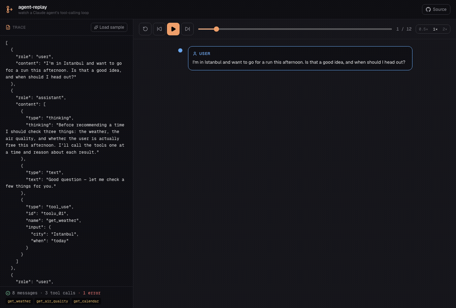

# agent-replay

**Watch a Claude agent's tool-calling loop.**

Paste a Claude agent trace and replay it step by step — every thought, tool
call, tool result, and decision — on a cinematic timeline you can scrub,
step through, and play back.

No API key. No backend. Everything runs in your browser.

**[Live → agent-replay.vercel.app](https://agent-replay.vercel.app)**



---

## Why

When a model uses tools, a single "answer" is really a loop: the agent thinks,
calls a tool, reads the result, decides what to do next, and repeats until it
can answer. That loop is where agents get interesting — and where they go
wrong — but it's normally buried in a wall of JSON.

agent-replay turns that JSON into something you can actually *watch*: a timeline
where each thought, call, and result is its own step, colour-coded and revealed
in order. Great for debugging an agent, explaining one, or just seeing how the
tool loop actually unfolds.

## What it does

- **Paste a trace** — drop in the `messages` array from any Claude tool-use
  conversation (or a whole request body).
- **Cinematic replay** — press play and the loop reveals itself step by step;
  scrub the timeline, step frame-by-frame, or change speed.
- **Every step, typed** — user turns, thinking blocks, assistant text, tool
  calls (with formatted input), and tool results are each their own card.
- **Failure-aware** — tool results flagged `is_error` are rendered in red, so
  you can see exactly where an agent had to recover.
- **Trace stats** — message count, tool-call count, the set of tools used, and
  how many calls errored.
- **Keyboard transport** — space to play/pause, arrow keys to step.
- **Zero setup** — no key, no account, no server. Loads with a sample trace.

## The sample trace

agent-replay opens on a built-in trace: an agent deciding whether the user
should go for a run. It checks the weather, hits an air-quality tool that
**times out**, recovers gracefully, checks the calendar, and gives a final
answer — a realistic loop with a thinking block and a tool failure.

## How it works

```
src/
  app/
    page.tsx          playback state, transport, keyboard shortcuts
    globals.css       design tokens, dark theme
  components/
    TraceInput.tsx    JSON editor + live validation + trace stats
    ReplayStage.tsx   the timeline + auto-follow scrolling
    StepCard.tsx      one step — colour, icon, body per kind
    Controls.tsx      play / pause / step / scrub / speed
  lib/
    parse.ts          JSON → validated, flattened list of steps
    sample.ts         the built-in demo trace
    types.ts          trace + step types
```

`parse.ts` is the core: it accepts the Anthropic Messages API shape, walks each
message's content blocks, resolves every `tool_result` back to the tool it came
from, and flattens the whole conversation into a single ordered list of steps
the timeline can render. Invalid JSON and malformed traces fail gracefully with
a readable message.

## Trace format

Paste the `messages` array from a Claude conversation that uses tools — either
the bare array or a full request body `{ "messages": [...] }`:

```json
[
  { "role": "user", "content": "What's the weather in Istanbul?" },
  { "role": "assistant", "content": [
      { "type": "text", "text": "Let me check." },
      { "type": "tool_use", "id": "toolu_01",
        "name": "get_weather", "input": { "city": "Istanbul" } }
  ]},
  { "role": "user", "content": [
      { "type": "tool_result", "tool_use_id": "toolu_01",
        "content": "22°C, clear" }
  ]},
  { "role": "assistant", "content": [
      { "type": "text", "text": "It's 22°C and clear in Istanbul." }
  ]}
]
```

`text`, `thinking`, `tool_use`, and `tool_result` blocks are all understood.

## Run locally

```bash
npm install
npm run dev
# open http://localhost:3000
```

## Deploy

Static, no environment variables. One-click on Vercel:

[](https://vercel.com/new/clone?repository-url=https://github.com/ferhatatagun/agent-replay)

## Tech

Next.js 16 · React 19 · TypeScript · Tailwind CSS v4 · Framer Motion

## License

MIT — see [LICENSE](LICENSE).
